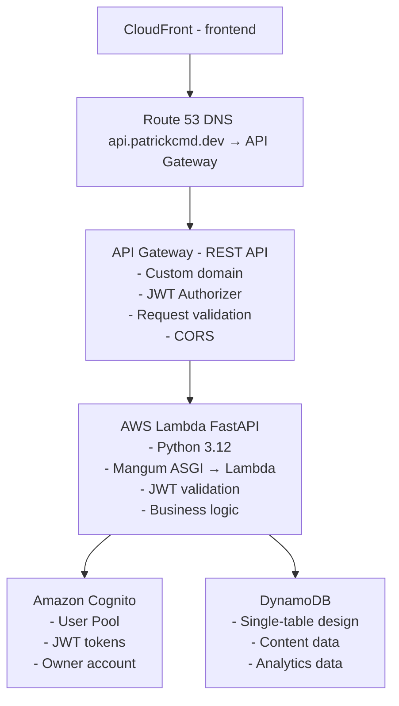

# Backend API - Cloud Resume Challenge

**Serverless FastAPI Backend with AWS Lambda, API Gateway, DynamoDB, and Cognito**

## Table of Contents

- [Overview](#overview)
- [Architecture](#architecture)
- [Technology Stack](#technology-stack)
- [Authentication & Authorization](#authentication--authorization)
- [Database Design](#database-design)
- [API Implementation](#api-implementation)
- [Deployment](#deployment)
- [Development Setup](#development-setup)
- [Testing](#testing)
- [Monitoring](#monitoring)

---

## Overview

This is a serverless REST API backend for the Cloud Resume Challenge portfolio website. The API provides:

- **Authentication**: Amazon Cognito-based JWT authentication
- **Content Management**: CRUD operations for blog posts, projects, certifications
- **Analytics**: Visitor tracking and content view analytics
- **Database**: DynamoDB single-table design
- **Deployment**: AWS SAM (Serverless Application Model)

### Key Features

- ✅ **Amazon Cognito Authentication** - Managed user authentication and JWT tokens
- ✅ **DynamoDB Single-Table Design** - Optimized access patterns
- ✅ **AWS Lambda + FastAPI** - Serverless Python backend
- ✅ **API Gateway REST API** - Managed API with custom domain
- ✅ **AWS SAM Deployment** - Infrastructure as Code
- ✅ **Owner-Only Access** - Single user authentication model
- ✅ **CloudWatch Monitoring** - Logs and metrics

---

## Architecture

### High-Level Architecture



### Request Flow

1. **Frontend** → Makes API request to `api.patrickcmd.dev`
2. **Route 53** → Routes to API Gateway
3. **API Gateway** → Validates JWT token with Cognito Authorizer
4. **Lambda** → Processes request with FastAPI
5. **DynamoDB** → Stores/retrieves data
6. **Lambda** → Returns response to API Gateway
7. **API Gateway** → Returns response to frontend

---

## Technology Stack

### AWS Services

| Service | Purpose | Configuration |
|---------|---------|---------------|
| **AWS Lambda** | Serverless compute | Python 3.12, 1024MB memory, 30s timeout |
| **API Gateway** | REST API management | Regional API, custom domain, JWT authorizer |
| **DynamoDB** | NoSQL database | Single-table design, on-demand billing |
| **Cognito User Pool** | User authentication | Owner-only pool, JWT tokens |
| **CloudWatch** | Logging & monitoring | Lambda logs, API Gateway logs, metrics |
| **ACM** | SSL/TLS certificates | Certificate for api.patrickcmd.dev |
| **Route 53** | DNS management | A record for api.patrickcmd.dev |
| **AWS SAM** | Infrastructure as Code | Template for all resources |

### Backend Stack

| Technology | Version | Purpose |
|------------|---------|---------|
| **Python** | 3.12 | Runtime language |
| **FastAPI** | Latest | Web framework |
| **Mangum** | Latest | ASGI to Lambda adapter |
| **Pydantic** | Latest | Data validation |
| **boto3** | Latest | AWS SDK for Python |
| **python-jose** | Latest | JWT handling |
| **uv** | Latest | Dependency management |

### Development Tools

- **uv** - Fast Python package manager (see [AGENTS.md](AGENTS.md))
- **AWS SAM CLI** - Local testing and deployment
- **pytest** - Unit and integration testing
- **black** - Code formatting
- **mypy** - Type checking

---

## Authentication & Authorization

**Documentation**:
- 📖 [docs/AUTHENTICATION.md](docs/AUTHENTICATION.md) - Authentication specification and planning
- ✅ [docs/AUTH_IMPLEMENTATION_SUMMARY.md](docs/AUTH_IMPLEMENTATION_SUMMARY.md) - Implementation summary
- 🧪 [docs/AUTH_TESTING.md](docs/AUTH_TESTING.md) - Testing documentation

### Overview

Authentication is handled entirely by **Amazon Cognito User Pool**:

- **Single User Model**: Only the portfolio owner (Patrick Walukagga) has an account
- **JWT Tokens**: Cognito issues JWT tokens for authentication
- **Token Validation**: JWT validation with Cognito public keys (JWKS)
- **Role-Based Access**: Owner role has full CRUD access

### Implementation Status

✅ **Completed** - All authentication features implemented and tested

- ✅ 4 authentication endpoints (login, refresh, logout, get user)
- ✅ JWT validation utilities (decode, validate, extract user)
- ✅ FastAPI dependencies (required auth, optional auth, owner-only)
- ✅ 58 comprehensive tests (100% passing)
- ✅ Complete documentation

### Authentication Flow

```
1. Frontend Login
   - POST /auth/login (email, password)
    - Lambda validates with Cognito
     - Cognito returns JWT tokens (IdToken, AccessToken, RefreshToken)
     - Frontend stores tokens

2. Authenticated Requests
   - Frontend sends request with Authorization: Bearer {IdToken}
     - API Gateway JWT Authorizer validates token with Cognito
     - If valid, forwards to Lambda with user context
     - Lambda processes request with user info
```

### Key Features

- **No password storage** - Cognito handles all credential management
- **Automatic token refresh** - Refresh tokens for session management
- **Built-in security** - MFA support, password policies, account recovery
- **JWT validation** - API Gateway validates tokens before Lambda invocation
- **User context** - Lambda receives decoded JWT claims

---

## Database Design

**Detailed planning**: See [docs/DYNAMODB-DESIGN.md](docs/DYNAMODB-DESIGN.md)

### Overview

We use **DynamoDB single-table design** for optimal performance and cost efficiency.

### Single Table Schema

**Table Name**: `portfolio-api-table`

| Attribute | Type | Description |
|-----------|------|-------------|
| `PK` | String (Partition Key) | Primary key for item identification |
| `SK` | String (Sort Key) | Sort key for relationships and queries |
| `GSI1PK` | String | Global Secondary Index partition key |
| `GSI1SK` | String | Global Secondary Index sort key |
| `EntityType` | String | Type of entity (BLOG, PROJECT, CERT, VISITOR, etc.) |
| `Status` | String | Publication status (PUBLISHED, DRAFT) |
| `CreatedAt` | String | ISO 8601 timestamp |
| `UpdatedAt` | String | ISO 8601 timestamp |
| `Data` | Map | Entity-specific attributes |

### Access Patterns Summary

**34 API endpoints mapped to 18 DynamoDB access patterns**:

#### Blog Posts (7 endpoints)
1. List all blog posts (by status)
2. Get blog post by ID
3. Create blog post
4. Update blog post
5. Delete blog post
6. Publish/unpublish blog post
7. List blog categories

#### Projects (7 endpoints)
8. List all projects (by status)
9. Get project by ID
10. Create/Update/Delete project
11. Publish/unpublish project

#### Certifications (7 endpoints)
12. List all certifications (by status, type)
13. Get certification by ID
14. Create/Update/Delete certification
15. Publish/unpublish certification

#### Analytics (10 endpoints)
16. Track visitor (increment counter with deduplication)
17. Get visitor count
18. Get visitor trends (daily/monthly)
19. Track content view (with deduplication)
20. Get content view counts
21. Get top content
22. Get total views

---

## API Implementation

### Project Structure

```
backend/
├── src/
│   ├── main.py                    # FastAPI application entry point
│   ├── config.py                  # Configuration and environment variables
│   ├── dependencies.py            # Dependency injection
│   
│   ├── api/                       # API routes
│   │   ├── __init__.py
│   │   ├── auth.py               # Authentication endpoints
│   │   ├── blog.py               # Blog post endpoints
│   │   ├── projects.py           # Project endpoints
│   │   ├── certifications.py     # Certification endpoints
│   │   ├── visitors.py           # Visitor tracking endpoints
│   │   └── analytics.py          # Analytics endpoints
│   
│   ├── models/                    # Pydantic models
│   │   ├── __init__.py
│   │   ├── auth.py               # User, login models
│   │   ├── blog.py               # Blog post models
│   │   ├── project.py            # Project models
│   │   ├── certification.py      # Certification models
│   │   ├── visitor.py            # Visitor models
│   │   └── analytics.py          # Analytics models
│   
│   ├── services/                  # Business logic
│   │   ├── __init__.py
│   │   ├── auth_service.py       # Cognito integration
│   │   ├── blog_service.py       # Blog operations
│   │   ├── project_service.py    # Project operations
│   │   ├── cert_service.py       # Certification operations
│   │   ├── visitor_service.py    # Visitor tracking
│   │   └── analytics_service.py  # Analytics operations
│   
│   ├── repositories/              # Data access layer
│   │   ├── __init__.py
│   │   ├── base.py               # Base repository
│   │   ├── blog_repository.py    # Blog DynamoDB operations
│   │   ├── project_repository.py # Project DynamoDB operations
│   │   ├── cert_repository.py    # Cert DynamoDB operations
│   │   └── analytics_repository.py # Analytics DynamoDB operations
│   
│   └── utils/                     # Utility functions
│       ├── __init__.py
│       ├── jwt.py                # JWT validation
│       ├── dynamodb.py           # DynamoDB helpers
│       └── errors.py             # Custom exceptions
├── tests/                         # Test suite
│   ├── unit/                     # Unit tests
│   ├── integration/              # Integration tests
│   └── e2e/                      # End-to-end tests
├── template.yaml                  # AWS SAM template
├── samconfig.toml                # SAM configuration
├── pyproject.toml                # Project dependencies (uv)
├── uv.lock                       # Locked dependencies
├── README.md                     # This file
├── docs/
│   ├── docs/AUTHENTICATION.md         # Auth planning
│   ├── docs/DYNAMODB-DESIGN.md        # Database planning
│   ├── DYNAMODB-SCAN-VS-QUERY.md # DynamoDB operations guide
│   └── QUICKSTART.md             # Quick start guide
└── AGENTS.md                     # Development guidelines
```

### FastAPI Application Structure

```python
# src/main.py
from fastapi import FastAPI
from mangum import Mangum
from api import auth, blog, projects, certifications, visitors, analytics

app = FastAPI(
    title="Portfolio API",
    version="1.0.0",
    openapi_url="/openapi.json"
)

# Include routers
app.include_router(auth.router, prefix="/v1/auth", tags=["Authentication"])
app.include_router(blog.router, prefix="/v1/blog", tags=["Blog Posts"])
app.include_router(projects.router, prefix="/v1/projects", tags=["Projects"])
app.include_router(certifications.router, prefix="/v1/certifications", tags=["Certifications"])
app.include_router(visitors.router, prefix="/v1/visitors", tags=["Visitors"])
app.include_router(analytics.router, prefix="/v1/analytics", tags=["Analytics"])

# Lambda handler
handler = Mangum(app)
```

---

## Deployment

**Deployment Tool**: AWS SAM (Serverless Application Model)

### SAM Template Structure

```yaml
# template.yaml
AWSTemplateFormatVersion: '2010-09-09'
Transform: AWS::Serverless-2016-10-31

Parameters:
  Environment:
    Type: String
    Default: prod
  DomainName:
    Type: String
    Default: api.patrickcmd.dev
  CognitoUserPoolId:
    Type: String
  ACMCertificateArn:
    Type: String

Resources:
  # DynamoDB Table
  PortfolioTable:
    Type: AWS::DynamoDB::Table

  # Lambda Function
  PortfolioApiFunction:
    Type: AWS::Serverless::Function

  # API Gateway
  PortfolioApi:
    Type: AWS::Serverless::Api

  # Cognito User Pool (if not pre-existing)
  CognitoUserPool:
    Type: AWS::Cognito::UserPool

  # Custom Domain
  ApiDomain:
    Type: AWS::ApiGatewayV2::DomainName
```

### Deployment Commands

```bash
# Build SAM application
sam build

# Deploy to AWS (guided first time)
sam deploy --guided

# Deploy subsequent updates
sam deploy

# Validate template
sam validate

# Local testing
sam local start-api
```

### Environment Variables

| Variable | Description | Example |
|----------|-------------|---------|
| `DYNAMODB_TABLE_NAME` | DynamoDB table name | `portfolio-api-table` |
| `COGNITO_USER_POOL_ID` | Cognito User Pool ID | `us-east-1_xxxxx` |
| `COGNITO_CLIENT_ID` | Cognito App Client ID | `xxxxxxxxxx` |
| `COGNITO_REGION` | AWS region | `us-east-1` |
| `ENVIRONMENT` | Environment name | `prod`, `staging`, `dev` |
| `LOG_LEVEL` | Logging level | `INFO`, `DEBUG` |

---

## Development Setup

### Prerequisites

- **Python 3.12+**
- **uv** package manager (see [AGENTS.md](AGENTS.md))
- **AWS CLI** configured with credentials
- **AWS SAM CLI** installed
- **Docker** (for local testing)

### Installation

```bash
# Clone repository
cd backend

# Install dependencies with uv
uv sync

# Activate virtual environment
source .venv/bin/activate  # Linux/Mac
.venv\Scripts\activate     # Windows
```

### Local Development

```bash
# Run FastAPI locally (without Lambda)
uv run uvicorn src.main:app --reload --port 8000

# Run with SAM local (simulates Lambda + API Gateway)
sam local start-api --port 3000

# Run specific Lambda function locally
sam local invoke PortfolioApiFunction --event events/test-event.json
```

### Adding Dependencies

```bash
# Add new package
uv add fastapi

# Add dev dependency
uv add --dev pytest

# Update dependencies
uv sync
```

### Environment Variables (Local)

```bash
# Create .env file
cat → .env << EOF
DYNAMODB_TABLE_NAME=portfolio-api-table-local
COGNITO_USER_POOL_ID=us-east-1_xxxxx
COGNITO_CLIENT_ID=xxxxxxxxxx
COGNITO_REGION=us-east-1
ENVIRONMENT=development
LOG_LEVEL=DEBUG
AWS_REGION=us-east-1
EOF
```

---

## Testing

**Documentation**: See [docs/AUTH_TESTING.md](docs/AUTH_TESTING.md) for comprehensive testing documentation

### Test Summary

✅ **58 authentication tests (100% passing)**

| Test Level | Tests | Coverage |
|-----------|-------|----------|
| **Unit Tests** | 35 | JWT utilities, auth endpoints |
| **Integration Tests** | 13 | Cognito integration |
| **E2E Tests** | 10 | Complete auth flows |

### Test Structure

```
tests/
├── conftest.py             # Shared fixtures
├── unit/                   # Unit tests (no AWS calls)
│   ├── test_jwt.py        # JWT validation (14 tests)
│   └── test_auth.py       # Auth endpoints (21 tests)
├── integration/            # Integration tests (mocked AWS)
│   └── test_cognito_integration.py  # Cognito (13 tests)
└── e2e/                    # End-to-end tests
    └── test_auth_flow.py  # Complete flows (10 tests)
```

### Running Tests

```bash
# Run all authentication tests
uv run pytest tests/unit/test_jwt.py tests/unit/test_auth.py tests/integration/ tests/e2e/ -v

# Run all tests
uv run pytest tests/ -v

# Run with coverage
uv run pytest tests/ --cov=src --cov-report=html

# Run specific test file
uv run pytest tests/unit/test_auth.py -v

# Run specific test class
uv run pytest tests/unit/test_auth.py::TestLoginEndpoint -v

# Run only unit tests
uv run pytest tests/unit/ -v

# Run only integration tests
uv run pytest tests/integration/ -v

# Run only e2e tests
uv run pytest tests/e2e/ -v
```

### Mocking AWS Services

```python
# Using moto for DynamoDB mocking
import boto3
from moto import mock_dynamodb

@mock_dynamodb
def test_create_blog_post():
    # Create mock DynamoDB table
    dynamodb = boto3.resource('dynamodb', region_name='us-east-1')
    table = dynamodb.create_table(...)

    # Test repository operations
    ...
```

---

## Monitoring

### CloudWatch Logs

```bash
# View Lambda logs
sam logs --stack-name portfolio-api --tail

# Filter logs
aws logs filter-log-events \
  --log-group-name /aws/lambda/portfolio-api \
  --filter-pattern "ERROR"
```

### Metrics to Monitor

| Metric | Description | Alarm Threshold |
|--------|-------------|-----------------|
| **Lambda Duration** | Execution time | → 10 seconds |
| **Lambda Errors** | Invocation errors | → 1% error rate |
| **Lambda Throttles** | Concurrent execution limit | → 0 |
| **API Gateway 4xx** | Client errors | → 5% of requests |
| **API Gateway 5xx** | Server errors | → 1% of requests |
| **API Gateway Latency** | Response time | → 2 seconds |
| **DynamoDB Throttles** | Read/write throttles | → 0 |

### X-Ray Tracing

Enable AWS X-Ray for distributed tracing:

```yaml
# In template.yaml
PortfolioApiFunction:
  Type: AWS::Serverless::Function
  Properties:
    Tracing: Active  # Enable X-Ray
```

---

## API Documentation

- **OpenAPI Specification**: [../openapi.yml](../openapi.yml)
- **Developer Guide**: [../API.md](../API.md)
- **Authentication Planning**: [docs/AUTHENTICATION.md](docs/AUTHENTICATION.md)
- **Database Design**: [docs/DYNAMODB-DESIGN.md](docs/DYNAMODB-DESIGN.md)
- **DynamoDB Operations Guide**: [DYNAMODB-SCAN-VS-QUERY.md](docs/DYNAMODB-SCAN-VS-QUERY.md)
- **Quick Start Guide**: [QUICKSTART.md](docs/QUICKSTART.md)

---

## Cost Estimation

### Monthly Cost Breakdown (Estimated)

| Service | Usage | Cost |
|---------|-------|------|
| **Lambda** | 1M requests, 1s avg duration | ~$0.20 |
| **API Gateway** | 1M requests | ~$3.50 |
| **DynamoDB** | On-demand, 10GB storage | ~$2.50 |
| **Cognito** | 1 active user | **Free** |
| **CloudWatch** | Standard logs | ~$0.50 |
| **Route 53** | 1 hosted zone | $0.50 |
| **ACM Certificate** | 1 certificate | **Free** |
| **Total** | | **~$7.20/month** |

> **Note**: Costs based on low traffic (< 50,000 requests/month). Actual costs may vary.

---

## Security Considerations

### Best Practices

- **JWT Validation at API Gateway** - Tokens validated before Lambda invocation
- **Least Privilege IAM** - Lambda has minimal DynamoDB permissions
- **HTTPS Only** - API Gateway enforces SSL/TLS
- **CORS Configuration** - Strict origin policies
- **Input Validation** - Pydantic models validate all inputs
- **Secrets in Parameter Store** - No hardcoded secrets
- **Cognito Password Policies** - Strong password requirements
- **MFA Support** - Optional MFA for owner account
- **CloudWatch Logging** - All requests logged
- **API Rate Limiting** - Throttling at API Gateway level

---

## Next Steps

### Phase 1: Planning (Current)
- [x] Architecture design
- [x] Authentication planning (see [docs/AUTHENTICATION.md](docs/AUTHENTICATION.md))
- [x] Database design (see [docs/DYNAMODB-DESIGN.md](docs/DYNAMODB-DESIGN.md))

### Phase 2: Implementation
- [x] Set up project structure
- [x] Implement authentication with Cognito
- [x] Implement JWT validation utilities
- [x] Implement authentication endpoints
- [x] Write comprehensive tests (58 tests, 100% passing)
- [ ] Implement DynamoDB repositories
- [ ] Implement remaining FastAPI endpoints (blog, projects, certifications)
- [ ] Write tests for remaining endpoints

### Phase 3: Deployment
- [ ] Create SAM template
- [ ] Set up Cognito User Pool
- [ ] Deploy to AWS
- [ ] Configure custom domain
- [ ] Set up monitoring and alarms

### Phase 4: Integration
- [ ] Update frontend to use real API
- [ ] Replace mock services
- [ ] End-to-end testing
- [ ] Performance optimization

---

## Contact & Support

**Author**: Patrick Walukagga
**Email**: p.walukagga@gmail.com
**Portfolio**: https://patrickcmd.dev
**GitHub**: [@PatrickCmd](https://github.com/PatrickCmd)

---

## License

This project is licensed under the [MIT License](../LICENSE).
